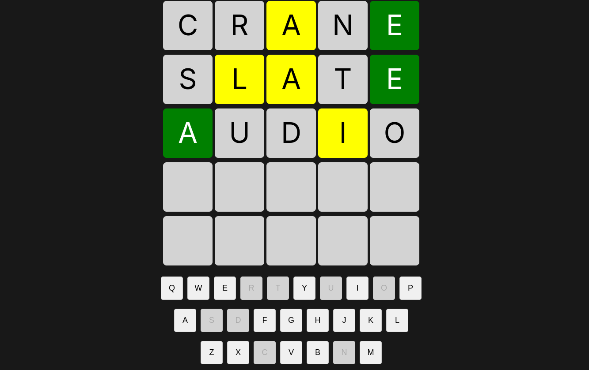
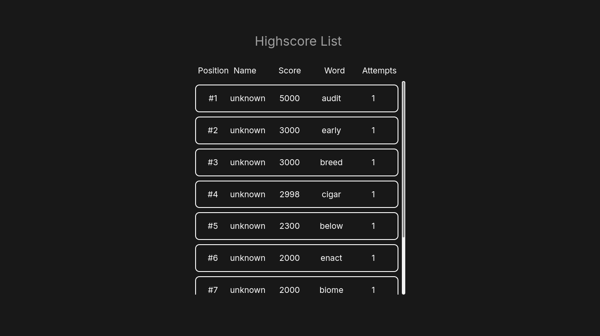

# Wordle

This is a [wordle](https://www.nytimes.com/games/wordle/index.html) clone. 



## Information
I wanted to create a fullstack app. This is my first try doing this. I created the backend in Rust and the frontend in Vue.js. I also added a PostgreSQL
database to save the user information.

The backend is built using Rust with the Actix-web framework, which provides a robust and efficient way to handle HTTP requests. The backend handles game logic, and interacts with the PostgreSQL database to store and retrieve user data and game statistics.

The frontend is developed using Vue.js, a progressive JavaScript framework for building user interfaces. It provides a dynamic and responsive user experience, allowing users to play the game, view their scores, and track their progress.

The PostgreSQL database is used to store user information, game states, and high scores. Docker is used to containerize the database, making it easy to set up and manage.

This project helped me learn and understand the intricacies of building a fullstack application, including backend development, frontend development, and database management. It also gave me experience with Docker for containerization and deployment.

## Installation
Clone the repository 
```bash
git clone https://github.com/Pazl27/wordle-clone.git
```
after cloning run the docker container with the databse 
```bash
cd backend/postgres
docker compose up -d
```
now run the backend
```bash
cargo run
```
now install the npm packages and run the frontend
```bash
cd frontend
npm install
npm run dev
```

## Todo
- [ ] Put everything into a container
- [ ] Put the highscore list into the GameOver/GameWon component
